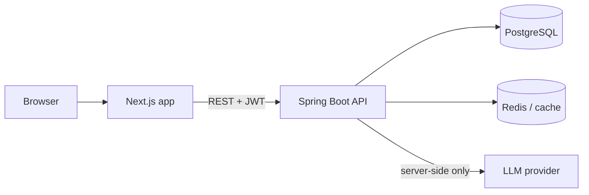

# Architecture



## Frontend (Next.js App Router)
```
src/app/
  (public)/        home, login, register, unauthorized
  (app)/owner/     dashboard, inventory, orders, shipments
  (app)/admin/     users, approvals
  (app)/supplier/  orders, stock
  (app)/buyer/     catalog, orders, shipments
src/components/    ui kit, navbar, chatbot widget
src/lib/           api client, auth helpers
```
- **Auth:** the API returns a JWT; Next.js route handlers store it in an **httpOnly cookie** (not localStorage)
  and forward it to the API. Middleware guards each role's route group.
- **Styling:** Tailwind CSS v4 → design tokens live in `globals.css` under `@theme` (ocean palette, see DAY-01).

## Backend (Spring Boot)
Modules: `auth`, `user`, `inventory`, `order`, `shipment`, `dashboard` (+ `admin`, `chat` to add).
- Order lifecycle: PENDING → CONFIRMED → PACKED → SHIPPED → DELIVERED (or CANCELLED), enforced in `OrderStatus`.
- Move from `ddl-auto: update` to **Flyway** migrations before deploying.

## AI assistant
`ChatService` → `LlmClient` interface → provider implementation (Gemini free tier first; swappable).
The API key stays on the server. Tools are **read-only** and scoped to the caller's role (order status,
stock availability, how-to help, fish-care tips). Rate-limit per user. Don't send private customer data to a
free-tier model.

## Free-tier hosting (decide on Day 6)
| Piece | Candidates |
|---|---|
| Frontend | Vercel Hobby (portfolio/non-commercial use) — verify current terms |
| API + DB | One VM with Docker Compose + Caddy (auto-HTTPS): Oracle Always Free (2 OCPU/12 GB ARM; capacity errors are common) **or** AWS Free Plan credits (6-month limit) |
| DB alternative | Hosted free Postgres (e.g. Neon/Supabase) if the VM is tight |

⚠️ **Don't create the AWS account until deployment day** — the free plan's 6-month clock starts at account creation.
Media: serve coral video/fish animations as compressed MP4/WebM (≤3 MB), not GIFs.
